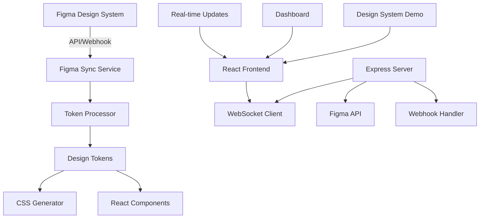

# 🎨 MEP Projects - Figma Design System Integration

[](https://react.dev/)
[](https://nodejs.org/)
[](https://vitejs.dev/)
[](https://tailwindcss.com/)
[](https://www.figma.com/developers/api)
[](https://socket.io/)

> **Una plataforma web completa con sincronización automática de Design System desde Figma en tiempo real.**

### 🎯 Problema que Resuelve

- **Inconsistencia Visual**: Elimina la desconexión entre diseño y desarrollo
- **Actualizaciones Manuales**: Automatiza la sincronización de tokens de diseño
- **Tiempo de Desarrollo**: Reduce significativamente el tiempo de implementación
- **Mantenimiento**: Facilita la evolución del sistema de diseño

### 🚀 Características Principales

- ✅ **Sincronización Automática**: Extrae y sincroniza colores, espaciados, tipografías y componentes desde Figma
- ✅ **Tiempo Real**: WebSocket para actualizaciones instantáneas cuando cambia el diseño
- ✅ **React 19 + Vite**: Frontend moderno con las últimas tecnologías
- ✅ **API REST Completa**: Backend Node.js con webhooks de Figma y autenticación
- ✅ **CSS Automático**: Genera automáticamente utilidades CSS basadas en tokens de Figma
- ✅ **Análisis de Componentes**: Extracción inteligente de componentes desde Figma
- ✅ **Dashboard Interactivo**: Interfaz para gestionar proyectos y visualizar el design system

## �️ Stack Tecnológico

### Frontend
- **React 19.1.1**: Biblioteca de JavaScript para construir interfaces de usuario
- **Vite 7.1.2**: Build tool ultrarrápido para desarrollo moderno
- **Tailwind CSS 3.4.13**: Framework CSS utility-first para diseño rápido
- **React Router DOM 7.8.2**: Navegación declarativa para aplicaciones React
- **Socket.IO Client 4.8.1**: Cliente WebSocket para comunicación en tiempo real
- **Axios 1.11.0**: Cliente HTTP para consumir APIs

### Backend
- **Node.js**: Runtime de JavaScript del lado del servidor
- **Express 5.1.0**: Framework web minimalista para Node.js
- **Socket.IO 4.8.1**: Servidor WebSocket para comunicación bidireccional
- **Axios 1.11.0**: Cliente HTTP para integración con APIs externas
- **CORS 2.8.5**: Middleware para habilitar CORS
- **dotenv 17.2.1**: Carga variables de entorno desde archivos .env

### Herramientas de Desarrollo
- **ESLint 9.33.0**: Linter para identificar y reportar patrones en JavaScript
- **Prettier**: Formateador de código automático
- **Nodemon 3.1.10**: Herramienta que reinicia automáticamente la aplicación
- **Concurrently 9.2.1**: Ejecuta múltiples comandos npm en paralelo

### Integraciones
- **Figma API**: Extracción automática de tokens de diseño
- **Webhook System**: Notificaciones automáticas de cambios en Figma
- **Design Token Pipeline**: Procesamiento y transformación de tokens

---

## 🏗️ Arquitectura del Sistema



## 📁 Estructura del Proyecto

```
mep-projects-website/
├── 📁 frontend/                    # React + Vite frontend
│   ├── 📁 src/
│   │   ├── 📁 tokens/             # 🎨 Design System sincronizado
│   │   │   ├── colors.js          # Colores extraídos de Figma
│   │   │   ├── spacing.js         # Espaciados y medidas
│   │   │   ├── typography.js      # Tipografías y text styles
│   │   │   ├── components.js      # Componentes extraídos
│   │   │   ├── mep-design-system.css # CSS completo generado
│   │   │   └── index.js           # Funciones principales
│   │   ├── 📁 pages/
│   │   │   ├── Home.jsx           # Página principal
│   │   │   ├── DesignSystem.jsx   # Showcase del design system
│   │   │   ├── 📁 auth/           # Autenticación
│   │   │   └── 📁 dashboard/      # Panel administrativo
│   │   ├── 📁 components/
│   │   │   ├── 📁 ui/            # Componentes reutilizables
│   │   │   ├── 📁 layout/        # Layouts y navegación
│   │   │   └── 📁 sections/      # Secciones de páginas
│   │   ├── 📁 context/           # React Context (Auth, etc.)
│   │   ├── 📁 hooks/             # Custom React Hooks
│   │   └── 📁 assets/            # Recursos estáticos
│   └── 📄 package.json
├── 📁 server/                      # Node.js backend
│   ├── webhook-server.js          # Servidor principal con WebSocket
│   ├── download-figma.js          # Cliente de Figma API
│   ├── process-figma-data.js      # Procesador de tokens
│   ├── figma-sync-simple.js       # Sincronizador
│   ├── figma-data.json           # Cache de datos de Figma
│   └── 📄 package.json
├── 📁 backend/                     # API adicional (opcional)
│   ├── 📁 api/                    # Rutas de API
│   ├── 📁 models/                 # Modelos de datos
│   └── 📄 package.json
├── 📁 scripts/                     # Scripts de utilidad
│   ├── create-admin.js           # Crear usuario administrador
│   └── setup-database.js        # Configuración de BD
├── 📄 .env                        # Variables de entorno
├── 📄 sync-figma.bat             # Script Windows
├── 📄 sync-figma.sh              # Script Unix/Linux
└── 📄 package.json               # Scripts principales
```

---

## � Tutorial de Instalación

### Prerrequisitos

- **Node.js 18+**: [Descargar aquí](https://nodejs.org/)
- **npm 8+**: Incluido con Node.js
- **Git**: [Descargar aquí](https://git-scm.com/)
- **Cuenta de Figma**: Para obtener token de acceso

### 1. Clonar el Repositorio

```bash
git clone https://github.com/tu-usuario/mep-projects.git
cd mep-projects
```

### 2. Configurar Variables de Entorno

Crear archivo `.env` en la raíz del proyecto:

```env
# 🎨 Figma Configuration
FIGMA_ACCESS_TOKEN=tu_token_de_figma_aqui
FIGMA_FILE_KEY=tu_file_key_de_figma

# 🌐 Development Ports
FRONTEND_PORT=5173
BACKEND_PORT=3001
NODE_ENV=development

# 🔐 Authentication (opcional)
JWT_SECRET=tu_jwt_secret_super_seguro
ADMIN_EMAIL=admin@mep.com
ADMIN_PASSWORD=mep123
```

### 3. Obtener Credenciales de Figma

#### 🔑 Token de Acceso Personal
1. Ve a [Figma Account Settings](https://www.figma.com/settings)
2. Scroll hasta "Personal Access Tokens"
3. Haz clic en "Create new token"
4. Dale un nombre descriptivo (ej: "MEP Projects Token")
5. Copia el token y pégalo en `FIGMA_ACCESS_TOKEN`

#### 📁 File Key del Proyecto
1. Abre tu archivo de Figma en el navegador
2. La URL será algo como: `https://www.figma.com/file/ABC123DEF456/Mi-Design-System`
3. Copia la parte `ABC123DEF456` (entre `/file/` y `/`)
4. Pégala en `FIGMA_FILE_KEY`

### 4. Instalar Dependencias

```bash
# Instalar dependencias raíz
npm install

# Instalar dependencias del frontend
cd frontend
npm install

# Instalar dependencias del servidor
cd ../server
npm install

# Volver a la raíz
cd ..
```

### 5. Sincronización Inicial con Figma

```bash
# Sincronizar design system desde Figma
npm run sync-figma

# O en Windows:
sync-figma.bat
```

### 6. Iniciar en Modo Desarrollo

```bash
# Iniciar frontend y backend simultáneamente
npm run dev

# Esto iniciará:
# ✅ Frontend en http://localhost:5173
# ✅ Backend en http://localhost:3001
# ✅ WebSocket en ws://localhost:3001
```

---

## 🖥️ Acceder a la Aplicación

Una vez iniciado, puedes acceder a:

| Servicio | URL | Descripción |
|----------|-----|-------------|
| 🏠 **Frontend Principal** | http://localhost:5173 | Aplicación React principal |
| 🎨 **Design System** | http://localhost:5173/design-system | Showcase del design system |
| 🔐 **Dashboard** | http://localhost:5173/dashboard | Panel administrativo |
| 🔐 **Login** | http://localhost:5173/login | Página de autenticación |
| 🛠️ **API Backend** | http://localhost:3001 | Servidor Express |
| 📊 **API Tokens** | http://localhost:3001/api/tokens | Ver tokens actuales |

### Credenciales de Prueba

Para acceder al dashboard utiliza:
- **Email**: `admin@mep.com`
- **Password**: `mep123`

---

## 📚 Guía de Uso del Design System

### 🎨 Tokens Disponibles

El sistema extrae automáticamente desde Figma y genera los siguientes tokens:

#### Colores
```javascript
import { mepColors, getMEPColor } from './tokens/index.js';

// Colores primarios
mepColors.primary        // Color primario principal
mepColors.secondary      // Color secundario
mepColors.accent         // Color de acento

// Escala de neutros
mepColors.neutral50      // Muy claro
mepColors.neutral100     // ...
mepColors.neutral900     // Muy oscuro

// Colores semánticos
mepColors.success        // Verde para éxito
mepColors.warning        // Amarillo para advertencias  
mepColors.error          // Rojo para errores
mepColors.info           // Azul para información
```

#### Espaciado
```javascript
import { mepSpacing } from './tokens/index.js';

mepSpacing.xs            // 4px - Extra pequeño
mepSpacing.sm            // 8px - Pequeño
mepSpacing.md            // 12px - Mediano
mepSpacing.lg            // 16px - Grande
mepSpacing.xl            // 24px - Extra grande
mepSpacing.2xl           // 32px
mepSpacing.3xl           // 48px
mepSpacing.4xl           // 64px
mepSpacing.5xl           // 80px
mepSpacing.6xl           // 96px
```

### 🧩 Componentes CSS Predefinidos

#### Botones
```html
<!-- Botón primario -->
<button class="mep-button mep-button-primary mep-hover-lift">
  Acción Principal
</button>

<!-- Botón secundario -->
<button class="mep-button mep-button-secondary">
  Acción Secundaria
</button>

<!-- Botón de peligro -->
<button class="mep-button mep-button-danger">
  Eliminar
</button>
```

#### Tarjetas
```html
<!-- Tarjeta básica -->
<div class="mep-card">
  <h3>Título de la tarjeta</h3>
  <p>Contenido de la tarjeta</p>
</div>

<!-- Tarjeta de proyecto -->
<div class="mep-card mep-card-project">
  <h3>Proyecto MEP</h3>
  <p>Detalles del proyecto</p>
</div>
```

#### Formularios
```html
<!-- Input básico -->
<input type="text" class="mep-input" placeholder="Ingresa texto...">

<!-- Textarea -->
<textarea class="mep-textarea" placeholder="Comentarios..."></textarea>
```

### ⚛️ Uso en React

```jsx
import React, { useEffect } from 'react';
import { applyMEPTokens, mepColors, getDesignSystemStats } from '../tokens/index.js';

function MiComponente() {
  useEffect(() => {
    // Aplicar tokens MEP al DOM
    const aplicado = applyMEPTokens();
    
    if (aplicado) {
      const stats = getDesignSystemStats();
      console.log('📊 Estadísticas del Design System:', stats);
    }
  }, []);

  return (
    <div className="mep-bg-neutral-50 mep-p-xl">
      <h1 className="mep-text-h1 mep-text-primary mep-mb-lg">
        Título con Design System
      </h1>
      
      <div className="mep-flex mep-gap-md">
        <button className="mep-button mep-button-primary mep-hover-lift">
          Botón Primario
        </button>
        <button className="mep-button mep-button-secondary">
          Botón Secundario
        </button>
      </div>
      
      <div className="mep-card mep-mt-xl">
        <h2 className="mep-text-h2 mep-text-neutral-900">
          Tarjeta de Contenido
        </h2>
        <p className="mep-text-body mep-text-neutral-600">
          Este contenido usa el design system sincronizado desde Figma.
        </p>
      </div>
    </div>
  );
}

export default MiComponente;
```

### 🎯 CSS Variables Globales

```css
/* Usar variables CSS directamente */
.mi-componente-custom {
  background-color: var(--mep-color-primary);
  padding: var(--mep-spacing-lg);
  border-radius: var(--mep-spacing-radius-md);
  color: var(--mep-color-neutral-50);
  font-family: var(--mep-font-primary);
}

/* Ejemplo de layout responsive */
.mi-layout {
  max-width: var(--mep-container-max-width);
  margin: 0 auto;
  padding: var(--mep-section-spacing-mobile);
}

@media (min-width: 768px) {
  .mi-layout {
    padding: var(--mep-section-spacing-desktop);
  }
}
```

---

## 🔄 Sincronización Automática

### Flujo de Trabajo

1. **🎨 Diseñador actualiza en Figma** → Modifica colores, espaciados o componentes
2. **🔔 Sistema detecta cambios** → Via webhook automático o sincronización manual
3. **⚡ Extrae nuevos tokens** → Procesa colores, espaciados, tipografías, componentes
4. **📄 Genera archivos actualizados** → `colors.js`, `spacing.js`, `typography.js`, `components.js`, CSS
5. **🔄 Actualiza frontend** → La aplicación aplica automáticamente los nuevos tokens
6. **📡 Notifica en tiempo real** → WebSocket informa a todos los clientes conectados

### Métodos de Sincronización

#### 🔄 Automática (Webhook)
```bash
# El webhook se activa automáticamente cuando cambias algo en Figma
# URL del webhook: http://tu-dominio.com:3001/figma-webhook
```

#### 🖱️ Manual (Comando)
```bash
# Sincronización completa manual
npm run sync-figma

# En Windows
sync-figma.bat

# En Linux/Mac  
./sync-figma.sh
```

#### 🌐 Via API
```bash
# Endpoint de sincronización
curl -X POST http://localhost:3001/sync-tokens

# Verificar tokens actuales
curl http://localhost:3001/api/tokens
```

### Verificar Sincronización

1. **🌐 Via Web**: Visita `http://localhost:5173/design-system`
2. **📡 Via API**: `GET http://localhost:3001/api/tokens`
3. **📝 Via Consola**: Revisa logs durante `npm run dev`
4. **🔍 Via DevTools**: Inspecciona variables CSS en el navegador

---

## 📊 Estadísticas del Sistema

**Estado Actual (Última Sincronización):**
- 🎨 **33 Colores** extraídos del design system de Figma
- 📐 **57 Espaciados** configurados (responsive + componentes)  
- 🧩 **107 Componentes** detectados y procesados desde Figma
- 📄 **CSS Completo** generado automáticamente (1200+ líneas)
- 🔧 **15 Utilidades** CSS personalizadas para MEP
- ⚡ **WebSocket** activo para sincronización en tiempo real

---

## 🌐 API Reference

### 🔄 Sincronización de Figma
| Método | Endpoint | Descripción |
|--------|----------|-------------|
| `POST` | `/figma-webhook` | Webhook automático desde Figma |
| `POST` | `/sync-tokens` | Sincronización manual completa |
| `GET` | `/api/tokens` | Obtener todos los tokens actuales |
| `GET` | `/api/tokens/colors` | Solo tokens de colores |
| `GET` | `/api/tokens/spacing` | Solo tokens de espaciado |

### 🔐 Autenticación (Demo)
| Método | Endpoint | Descripción |
|--------|----------|-------------|
| `POST` | `/api/auth/login` | Login con email/password |
| `GET` | `/api/auth/me` | Información del usuario actual |
| `POST` | `/api/auth/logout` | Cerrar sesión |

### 📡 WebSocket Events
| Evento | Datos | Descripción |
|--------|-------|-------------|
| `mep-tokens-updated` | `{ tokens, timestamp }` | Tokens actualizados desde Figma |
| `user-connected` | `{ userId, timestamp }` | Nuevo usuario conectado |
| `figma-sync-started` | `{ status: 'syncing' }` | Sincronización iniciada |
| `figma-sync-completed` | `{ status: 'success', stats }` | Sincronización completada |

---

## 🎯 Casos de Uso

### �‍🎨 Para Diseñadores
1. **Actualizar Design System en Figma**
   - Modifica colores, espaciados o componentes
   - El sistema sincroniza automáticamente
   - Ve los cambios reflejados instantáneamente

2. **Validar Implementación**
   - Visita `http://localhost:5173/design-system`
   - Compara con el diseño original en Figma
   - Verifica que todo se vea exactamente igual

### 👨‍💻 Para Desarrolladores
1. **Usar Tokens en Código**
   ```jsx
   // Usar colores y espaciados consistentes
   <div className="mep-bg-primary mep-p-xl">
     <h1 className="mep-text-h1 mep-text-neutral-900">
       Título
     </h1>
   </div>
   ```

2. **Recibir Actualizaciones en Vivo**
   - El WebSocket notifica cambios automáticamente
   - No necesitas refrescar la página
   - Los tokens se actualizan dinámicamente

### 📊 Para Product Managers
1. **Monitorear Consistencia**
   - Dashboard con estadísticas del design system
   - Verificar que diseño y código estén sincronizados
   - Revisar métricas de uso de componentes

2. **Aprobar Cambios**
   - Preview de cambios antes de producción
   - Historial de versiones del design system
   - Validación automática de accesibilidad

---

## 🛠️ Scripts Disponibles

### Desarrollo
```bash
npm run dev              # Iniciar frontend + backend en modo desarrollo
npm run dev:frontend     # Solo frontend (React + Vite)
npm run dev:server       # Solo backend (Express + WebSocket)
```

### Build y Producción
```bash
npm run build           # Build completo para producción
npm run build:frontend  # Build solo del frontend
npm run build:server    # Preparar servidor para producción
npm run start:prod      # Iniciar en modo producción
```

### Sincronización
```bash
npm run sync-figma      # Sincronizar design system completo
npm run test-figma      # Probar conexión con Figma API
npm run validate-tokens # Validar integridad de tokens
```

### Utilidades
```bash
npm run create-admin    # Crear usuario administrador
npm run setup-db        # Configurar base de datos (si aplica)
npm run clean           # Limpiar archivos temporales
npm run format          # Formatear código con Prettier
npm run lint            # Ejecutar ESLint
```

---

## 📱 Diseño Responsive

El design system incluye breakpoints y utilidades responsive automáticas:

### Breakpoints
```css
/* Mobile First */
.mep-container {
  padding: var(--mep-section-spacing-mobile);    /* < 768px */
}

@media (min-width: 768px) {
  .mep-container {
    padding: var(--mep-section-spacing-desktop);  /* >= 768px */
  }
}
```

### Contenedores
```css
--mep-container-max-width: 1200px;     /* Ancho máximo de contenedor */
--mep-content-max-width: 800px;        /* Ancho máximo de contenido */
--mep-section-spacing-mobile: 1rem;    /* Espaciado mobile */
--mep-section-spacing-desktop: 2rem;   /* Espaciado desktop */
```

### Utilidades Responsive
```html
<!-- Clases que se adaptan automáticamente -->
<div class="mep-grid-responsive">       <!-- Grid adaptativo -->
<div class="mep-spacing-responsive">    <!-- Espaciado adaptativo -->
<div class="mep-text-responsive">       <!-- Tipografía adaptativa -->
```

---

## 🔐 Seguridad y Autenticación

### Variables de Entorno Sensibles
```env
# 🔐 Mantener estos tokens seguros
FIGMA_ACCESS_TOKEN=figd_xxxxxxxxxxxxxxxxxxxxx
JWT_SECRET=tu_super_secreto_jwt_de_al_menos_32_caracteres

# 🌐 URLs de producción
PRODUCTION_FRONTEND_URL=https://tu-dominio.com
PRODUCTION_BACKEND_URL=https://api.tu-dominio.com
```

### Recomendaciones
- ✅ Nunca commits el archivo `.env` al repositorio
- ✅ Usa tokens de Figma con permisos mínimos necesarios
- ✅ Rota regularmente los tokens de acceso
- ✅ Configura CORS apropiadamente para producción
- ✅ Usa HTTPS en producción

---

## 🚀 Despliegue

### Frontend (Vercel/Netlify)
```bash
# Build para producción
npm run build:frontend

# Los archivos están en /frontend/dist
# Configura variables de entorno en tu plataforma
```

### Backend (Railway/Render/Heroku)
```bash
# Preparar para producción  
npm run build:server

# Configurar variables de entorno:
# FIGMA_ACCESS_TOKEN
# FIGMA_FILE_KEY
# NODE_ENV=production
```

### Variables de Entorno en Producción
```env
NODE_ENV=production
FIGMA_ACCESS_TOKEN=tu_token
FIGMA_FILE_KEY=tu_file_key
FRONTEND_URL=https://tu-dominio.com
BACKEND_URL=https://api.tu-dominio.com
PORT=3001
```

---


### 1. Fork del Repositorio
```bash
git clone https://github.com/tu-usuario/mep-projects.git
cd mep-projects
git checkout -b feature/nueva-funcionalidad
```

### 2. Setup de Desarrollo
```bash
npm install
cd frontend && npm install
cd ../server && npm install
cd ..
npm run dev
```

### 3. Hacer Cambios
- Sigue las convenciones de código existentes
- Añade tests si es necesario
- Actualiza documentación

### 4. Pull Request
```bash
git add .
git commit -m "feat: añadir nueva funcionalidad"
git push origin feature/nueva-funcionalidad
```

### Convenciones de Commits
- `feat:` Nueva funcionalidad
- `fix:` Corrección de bug
- `docs:` Cambios en documentación
- `style:` Cambios de formato
- `refactor:` Refactorización de código
- `test:` Añadir tests

---

## 🐛 Solución de Problemas

### Error: "Cannot connect to Figma API"
```bash
# Verificar token
echo $FIGMA_ACCESS_TOKEN

# Probar conexión
npm run test-figma

# Regenerar token en Figma Settings
```

### Error: "Frontend not loading"
```bash
# Verificar puertos
lsof -i :5173
lsof -i :3001

# Reinstalar dependencias
rm -rf node_modules frontend/node_modules server/node_modules
npm install
cd frontend && npm install
cd ../server && npm install
```

### Error: "WebSocket connection failed"
```bash
# Verificar servidor backend
curl http://localhost:3001/health

# Verificar variables de entorno
cat .env
```

### Error: "Design system not applying"
```bash
# Verificar tokens generados
ls -la frontend/src/tokens/

# Forzar sincronización
npm run sync-figma

# Verificar consola del navegador
# DevTools > Console > Buscar errores MEP
```

<div align="center">

</div>
